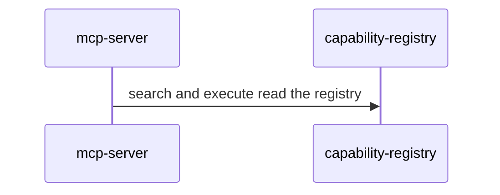

# Recap block

One block. Copy this shape. Put the rollup in the summary (`composes` and low,
`extends` and medium, or `adds` and high). Label every message with what this PR
does. Leave a blank line after `
` and around every fence, or GitHub
will not render the diagram. Participants are primitive `id`s from
`primitives.yaml`. Prefer a sequence diagram. Add a second diagram only when it
shows something the first cannot.

<!-- system-recap:start -->

System recap: <b>composes existing primitives</b> (low risk)

**Mode:** recap · **Base:** `main` @ `abc1234` · **Head:** `def5678`

**Classification:** composes. No primitives added or changed.

### Primitives touched

| Primitive             | Group     | Impact   |
| --------------------- | --------- | -------- |
| `mcp-server`          | surfaces  | composes |
| `capability-registry` | assistant | composes |

### Change flow

MCP search and execute read the capability registry.

<!-- system-recap:end -->
