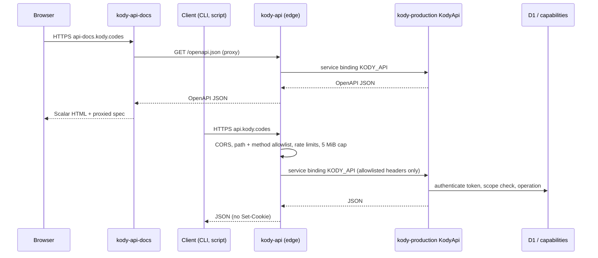

# Open API

The Kody Open API is the public HTTP surface at `https://api.kody.codes`. It
serves JSON only: `GET /openapi.json` (OpenAPI 3.1) and the versioned `/v1`
operations. Interactive HTML docs live on a separate Worker at
`https://api-docs.kody.codes` (Scalar). The same operations back the MCP `api`
tool, and two of them form the CapabilityProxy that local execute
(`@kodycodes/cli`) calls.

There is no account UI for API token management — mint, list, and revoke via the
CLI / MCP `api` tool only.

## Workers

- `kody-api` (`packages/api-worker/`) is a thin edge script on the
  `api.kody.codes` custom domain. It answers `/health` itself, allows only `/`,
  `/openapi.json`, and `/v1/*`, applies per-IP (`API_IP_RATE_LIMITER`, 600/min)
  and per-token (`API_TOKEN_RATE_LIMITER`, 300/min, keyed by API token id or a
  SHA-256 of an opaque Bearer such as CLI MCP OAuth — never the secret
  plaintext) limits, caps buffered bodies at 5 MiB (413), and forwards only
  `Authorization`, `Content-Type`, `Accept`, `User-Agent`, and
  `CF-Connecting-IP`. `Cookie` and `X-Kody-*` never reach origin, and origin
  `Set-Cookie` never reaches the client. CORS allows any origin because auth is
  bearer-only. It never serves HTML.
- `kody-api-docs` (`packages/api-docs-worker/`) is the interactive docs host on
  `api-docs.kody.codes`. It serves a Scalar shell at `/`, proxies
  `/openapi.json` from the live API, and answers `/health`. DNS and the
  certificate come from `custom_domain: true` on deploy (same as
  `api.kody.codes`).
- Origin exports `KodyApi` (`packages/worker/src/open-api/kody-api.ts`), a
  `WorkerEntrypoint` that lazy-loads the handler so the origin startup budget
  does not pay for it. Operations run on origin so they share the capability
  registry, D1, and account gates with MCP. The Remix UI does not call the Open
  API; both use the same domain modules. The OpenAPI document's `externalDocs`
  points at `https://api-docs.kody.codes`.
- Custom domains create their own DNS record and certificate on deploy, so
  `api.kody.codes` and `api-docs.kody.codes` need no manual DNS step as long as
  no conflicting record already exists in the `kody.codes` zone. Previews deploy
  `kody-pr-<n>-api` on `workers.dev`, bound to that preview's origin. API docs
  are production-only (they always proxy the live OpenAPI document).

## Operations

`packages/worker/src/open-api/operations.ts` is the route table and the source
of truth for `/openapi.json`. Most operations are registry capabilities
(`operationId` is the capability name and inputs are its schema; path params map
to same-named inputs, `GET`/`DELETE` read the query string, and other methods
read a JSON body). Token and CapabilityProxy operations are native.

`/v1` is additive: add operations freely; never rename an `operationId`, change
a method or path, or remove an operation without a new version.

Never in the Open API: `execute`, secret plaintext, the inbound webhook receive
path, package-app HTTP/WebSocket/realtime traffic, admin capabilities, and
runtime-only capabilities (values, invocation tokens, package-app fetch,
synthetic dispatch).

Plain API reads and token mints need no execute entitlement and never start a
Dynamic Worker. Writes hold the account write lease, like MCP tool calls.

## Tokens

Scoped API tokens (`kody_at_<id>_<secret>`) are the primary HTTP credential for
the Open API. They are a separate credential class from MCP OAuth
([ADR 0053](../decisions/0053-scoped-api-tokens-are-not-mcp-oauth-scopes.md)).
Kody stores only a SHA-256 hash; the value is returned once, on mint or rotate.

On **local-execute HTTP only** (CapabilityProxy +
`POST /v1/local-execute/package-graph`), a valid CLI MCP OAuth access token from
`kody login` (official CLI CIMD client id) is also accepted as Bearer with the
full MCP grant, without API-token scope checks
([ADR 0055](../decisions/0055-cli-mcp-oauth-local-execute-http.md)). Other `/v1`
operations reject non-`kody_at_` bearers with `401 Invalid API token`.

- Scopes: `<resource>:read` and `<resource>:write` for `account`, `memories`,
  `secrets`, `packages`, `repos`, `jobs`, `webhooks`, `email`, `integrations`,
  `mcp-servers`, `runs`, `storage`, `community`, and `tokens`; plus
  `search:read` and `local-execute`. `:write` satisfies `:read`. Capabilities
  that sign, lock, or run caller queries (`secretLock`, `secretJwtSign`,
  `secretProviderLock`, `storageQuery`) need `:write`. `local-execute` grants
  the whole `kody.*` runtime surface, like cloud execute.
- TTL: tokens expire after `idle_ttl_seconds` without use (default 900, range
  60–3600). Each authenticated request slides `expires_at` forward (debounced to
  one write per minute), never past `max_expires_at` (default 24 hours, at most
  7 days).
- Minting: the first token comes from the MCP `api` tool (`tokenCreate`, full
  MCP grant). A token holding `tokens:write` can mint more, but only with scopes
  it holds and never outliving its own `max_expires_at`. At most 50 active
  tokens per account.
- **CLI bootstrap (ADR 0056):** `cliCredentialBootstrap` (capability +
  `POST /v1/tokens/bootstrap`) returns a one-shot `kody_bc_…` code (never
  `kody_at_`). `POST /v1/tokens/bootstrap/redeem` is code-authenticated only (no
  Bearer; rejected for MCP `api`) and mints a normal `kody_at_` with
  `created_via: cli-bootstrap` for the CLI to store. Bootstrap tokens default to
  a 2-week sliding idle TTL (`idle_ttl_seconds` 1209600) and a 3-month absolute
  lifetime (`max_lifetime_seconds` 7776000), not the shorter `tokenCreate`
  defaults above. CLI `whoami` / `GET /v1/tokens/current` surface sliding
  `expires_at` (the idle window).
- Mint and rotate return `token`, `token_type: "Bearer"`, `id`, `name`,
  `scopes`, `status`, `idle_ttl_seconds`, `expires_at`, `max_expires_at`, and
  timestamps. List and get never return the value.
- `GET /v1/tokens/current`, `POST /v1/tokens/current/rotate`, and
  `DELETE /v1/tokens/current` need no scope and act on the calling token.
- Account gates match `/mcp`: verified email, not suspended, not deleting, and
  the token must postdate the last password change.
- Redaction: `redactApiTokens` (`packages/shared/src/api-token-format.ts`) masks
  `kody_at_…` values in API error envelopes, MCP `api` tool failure logs, and
  execute results, logs, and errors (what run records and Activity store),
  whether or not the run has secrets. The MCP `api` tool does not write run
  records, and its success log carries no result.

## CapabilityProxy

The cloud half of local execute. The CLI runs modules in a local workerd and
forwards each `kody:runtime` call here. Static `kody:@…` imports are resolved by
`POST /v1/local-execute/package-graph` (same `local-execute` scope): origin
returns published, stamped importable-module artifacts for embedding — it does
**not** execute the user module and does not silently hop to `kody.execute`. See
[Local CLI execute](../../guides/local-execute.md) and
[Open API](../../guides/open-api.md).

| Route                                  | Body                                  | 200 response                                                                    |
| -------------------------------------- | ------------------------------------- | ------------------------------------------------------------------------------- |
| `GET /v1/capability-proxy/session`     | none                                  | `{ scopes, expiresAt, maxExpiresAt, idleTtlSeconds, user, limits }` (camelCase) |
| `POST /v1/capability-proxy/call`       | `{ path, args, conversationId? }`     | `{ result }`                                                                    |
| `POST /v1/local-execute/package-graph` | `{ code, imports?, conversationId? }` | `{ modules: [{ name, esModule }], imports, warnings }`                          |

- `path` is the `kody:runtime` property path: `['kody', name]`,
  `['kody', 'mcp', server, tool]`, or `['workflows', 'create']`. `args` are
  positional (at most 8; paths at most 8 segments). Unknown keys answer 400.
  `['packages', 'invoke']` answers the same unknown-path 404 as any other
  unbound runtime path. Token-auth / `--local` package composition uses
  package-graph download + local workerd embedding — not whole-module
  `kody.execute`.
- Package-graph uses the same static-import scanner and resolution policy as
  cloud ad hoc execute (own copy → share grant → platform scopes only when
  allowed). Prefer published `importable-module` artifacts; unpublished or
  missing artifacts answer `400 package_import_unpublished`. Literal dynamic
  `import("kody:@…")` answers `400 unsupported_dynamic_package_import`.
- Calls dispatch through the same `kody.*` tool map as ad hoc cloud execute, so
  capability behavior, `kody.mcp`, and workflows match the cloud. Caller errors
  from a capability keep their status and message. Unexpected capability
  failures return 500 `capability_error`, and their message hides `kody_at_`
  tokens and any secret values the call wrote. Platform failures outside the
  capability return the generic `internal_error`, and the details are logged
  server-side.
- Confused-deputy limits: the request is JSON arguments only. No caller header
  or cookie is forwarded into a capability, and the edge strips `Cookie` and
  `X-Kody-*` before origin sees the request.
- Order of checks: bearer credential (401), then — for `kody_at_` tokens only —
  the `local-execute` scope (403 `insufficient_scope`). CLI MCP OAuth skips the
  scope check (full MCP grant on these routes).
- Auth: `kody_at_…` with `local-execute`, or a valid `kody login` MCP OAuth
  access token for this origin
  ([ADR 0055](../decisions/0055-cli-mcp-oauth-local-execute-http.md)).
- Authenticated outbound fetch: `path: ['kody','authenticatedFetch']` with
  `{ providerName, request: { url, method?, headers?, body? } }`. Origin runs
  the same placeholder + fetch-gateway model as cloud execute (and host-side
  `integrationTokenRefresh` on auth failure), then returns
  `{ status, statusText, headers, bodyBase64 }`. Bodies over 4 MiB are rejected.
  The package-graph runtime shim implements local `createAuthenticatedFetch` by
  hopping here so OAuth access tokens never enter workerd. Nested
  `…/.__published_bundle__/…/.__kody_virtual__/runtime.js` modules re-export the
  primary shim; the primary imports host `kody:runtime` with a relative
  specifier (`../kody:runtime`) because workerd path-joins bare `kody:runtime`
  under path-like module names. Published bundles that **inline** the virtual
  runtime (Dropbox-style esbuild) are rewritten onto that same shim during
  package-graph prep so `--local` does not depend on cloud's ALS preload.
- Secret-bearing ambient fetch: `path: ['kody','gatewayFetch']` with
  `{ request: { url, method?, headers?, body? }, packageId? }`. Origin runs
  `executeGatewayFetch` / `expandSecretPlaceholders` (same as cloud sandbox
  `fetch`). Package-graph rewrites published modules so ambient `fetch` hops
  here and quoted `{{secret:name|scope=…}}` literals become
  `__kodySecretRef(...)` — secret plaintext never enters local workerd, and a
  missing secret fails closed before any third-party request.
- OAuth client-credentials: `path: ['kody','oauthClientCredentials']` with the
  same argument shape as cloud `oauthClientCredentials(...)`. Origin expands
  secret placeholders through the fetch gateway.
- Stamped `packageStorage` / `packageSecrets`: local shim factories hop as
  `kody.packageStorage*` / `kody.packageSecret*` (secret authority via
  `__kodySecretAuthorityPackageId`). Each local hop accepts only caller-owned
  package ids; share-granted packages cannot use these capabilities on
  `execute --local` and must use cloud execute instead. Ad hoc (unstamped)
  `packageStorage()` / `packageSecrets` on the host `kody:runtime` remain
  unbound, matching cloud ad hoc execute.

## Errors

Every error is `{ error: { code, message, details? } }` with
`Cache-Control: no-store`.

| Status | `code`                                                                                                             |
| ------ | ------------------------------------------------------------------------------------------------------------------ |
| 400    | `invalid_request`, `package_import_unresolved`, `package_import_unpublished`, `unsupported_dynamic_package_import` |
| 401    | `unauthorized` (missing, invalid, expired, or revoked token)                                                       |
| 403    | `insufficient_scope`, `email_verification_required`, `account_suspended`                                           |
| 404    | `not_found`, `feature_unavailable` (capability or MCP gate)                                                        |
| 405    | `method_not_allowed` (with `Allow`)                                                                                |
| 409    | `account_deleting`                                                                                                 |
| 413    | `payload_too_large`                                                                                                |
| 415    | `unsupported_media_type`                                                                                           |
| 429    | `rate_limited` (edge, `Retry-After`), `entitlement_limit`                                                          |
| 500    | `capability_error`, `internal_error`                                                                               |

## Metering

Each operation records one observe-only `api_call`
([usage metering](./usage-metering.md)); CapabilityProxy hops use
`capability-proxy:<path>` as the entity id, and package-graph prep uses
`localExecutePackageGraph`. On local-execute native failures the entity id
appends the ApiError code (for example
`localExecutePackageGraph:package_import_unresolved`, or
`capabilityProxySession:unauthorized`) so session start, package-graph prep, and
auth failures are distinguishable in Analytics Engine without a new event type
or fake `execute` / `dynamic_worker_day` charges. The capability behind a call
meters itself as usual (email sends, outbound fetches, package runs). Local
execute CPU runs on the user's machine and is never recorded as `execute` or
`dynamic_worker_day`.

## MCP `api` tool

The third MCP tool beside `search` and `execute`
(`packages/worker/src/mcp/tools/api.ts`). Input is `{ operationId, params }`
with `params` as one flat object (path, query, and body fields together). It
runs with the session's MCP grant, so token scopes do not apply on mint paths.
Capability-level feature flags still gate individual operations when registered.
